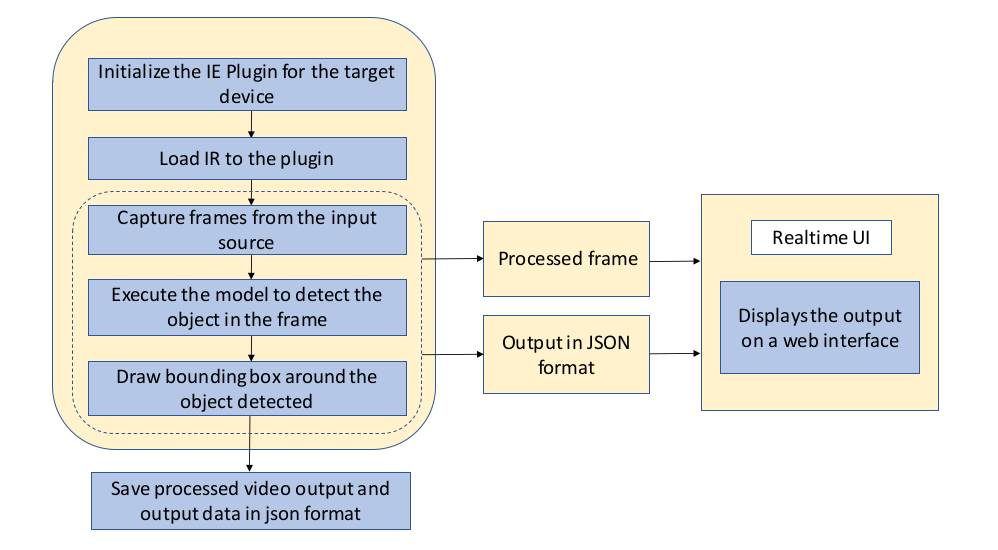

# Store Traffic Monitor

| Details               |                    |
| --------------------- | ------------------ |
| Target OS:            | Ubuntu\* 16.04 LTS |
| Programming Language: | C++                |
| Time to Complete:     | 50-70min           |


**Figure 1:** An application capable of detecting objects on any number of screens.

## What It Does

This application is one of a series of IoT reference implementations illustrating how to develop a working solution for a problem. The reference implementation demonstrates how to create a smart video IoT solution using Intel® hardware and software tools. This application monitors the activity of people inside and outside a facility, and it counts product inventory.

## How It Works

The application uses the Inference Engine included in the Intel® Distribution of OpenVINO™ toolkit. A trained neural network detects objects by displaying a green bounding box over them. This reference implementation identifies multiple objects entering the frame and records the class of each object, the count, and the time the object entered the frame.


**Figure 2:** Architectural Diagram.

## Requirements

### Hardware

- 6th Generation Intel® Core™ processor with Iris® Pro graphics or Intel® HD Graphics

### Software

- [Ubuntu\* 16.04 LTS](http://releases.ubuntu.com/16.04/)<br>
  *Note*: We recommend using a 4.14+ Linux* kernel with this software. Run the following command to determine the kernel version:

  ```
  uname -a
  ```

- OpenCL™ Runtime Package

- Intel® Distribution of OpenVINO™ toolkit R5 Release

## Setup

### Install Intel® Distribution of OpenVINO™ toolkit

Refer to [Install Intel® Distribution of OpenVINO™ toolkit for Linux*](https://software.intel.com/en-us/articles/OpenVINO-Install-Linux) to learn how to install and configure the toolkit.

Install the OpenCL™ Runtime Package to run inference on the GPU, as shown in the instructions below. It is not mandatory for CPU inference.

### Install FFmpeg*

FFmpeg* is installed separately from the Ubuntu repositories:

```
sudo apt update
sudo apt install ffmpeg
```

## Configure the Application

### Which Model to Use

The application works with any object-detection model, provided it has the same input and output format of the SSD model.  
The model can be any object detection model:

- Provided by Intel® Distribution of OpenVINO™ toolkit.  
  Find these models in the `deployment_tools/intel_models` folder.
- Downloaded using the **model downloader**, provided by Intel® Distribution of OpenVINO™ toolkit.   
  Find these models in the `deployment_tools/model_downloader/object_detection` folder.
- Built by the user.

By default, this application uses the mobilenet-ssd model, that can be accessed using the **model downloader**. The **model downloader** downloads the model as Caffe* model files. These need to be passed through the **model optimizer** to generate the IR (the __.xml__ and __.bin__ files) that will be used by the application.

#### Download the mobilenet-ssd Intel® Model

- Go to the **model downloader** directory present inside Intel® Distribution of OpenVINO™ toolkit install directory:

  ```
  cd /opt/intel/computer_vision_sdk/deployment_tools/model_downloader/
  ```

- Specify which model to download with `--name` and the output path with `-o`; otherwise, the model will be downloaded to the current folder. Run the model downloader with the following command:

  ```
  sudo ./downloader.py --name mobilenet-ssd
  ```

  The model will be downloaded inside the _object_detection/common_ directory. To make it work with the Intel® Distribution of OpenVINO™ toolkit, the model needs to be passed through the **model optimizer** to generate the IR (the __.xml__ and __.bin__ files).   

  **Note:** If you haven't configured the **model optimizer** yet, follow the instructions to configure it provided [here](https://software.intel.com/en-us/articles/OpenVINO-ModelOptimizer).   

- After configuring the model optimizer, go to the **model optimizer** directory:

  ```
  cd /opt/intel/computer_vision_sdk/deployment_tools/model_optimizer/
  ```

- Run this command to optimize mobilenet-ssd:

  ```
  ./mo_caffe.py --input_model /opt/intel/computer_vision_sdk/deployment_tools/model_downloader/object_detection/common/mobilenet-ssd/caffe/mobilenet-ssd.caffemodel  -o $HOME/store-traffic-monitor/application/resources --data_type FP32 --scale 256 --mean_values [127,127,127]
  ```

  **Note:** Replace `$HOME` in the command with the path to the reference-implementation's folder.

- To optimize the model for FP16:

  ```
  ./mo_caffe.py --input_model /opt/intel/computer_vision_sdk/deployment_tools/model_downloader/object_detection/common/mobilenet-ssd/caffe/mobilenet-ssd.caffemodel -o $HOME/store-traffic-monitor/application/resources --data_type FP16 --scale 256 --mean_values [127,127,127]
  ```

### The Labels File

The application requires a _labels_ file associated with the model used for detection. 

 All detection models work with integer labels, not string labels (e.g., For the ssd300 and mobilenet-ssd models, the number 15 represents the class "person".). Each model must have a _labels_ file, which associates an integer, the label the algorithm detects, with a string denoting the human-readable label.  

The _labels_ file is a text file containing all the classes/labels that the model can recognize, in the order that it was trained to recognize them, one class per line.<br>

For mobilenet-ssd model, _labels.txt_ file is provided in the _application/resources_ directory.

### The Config File

The _application/resources/conf.txt_ contains the videos that will be used by the application as input. Each line, formatted as `path/to/video label`,  represents one video and its path location on a local system.   

For example:

```
videos/video1.mp4 person
```

The `path/to/video` is the path to an input video file followed by the `label` of the class (e.g., person, bottle) to be detected on that video. The labels used in the _conf.txt_ file must coincide with the labels from the _labels_ file.

The application can use any number of videos for detection (i.e., the _conf.txt_ file can have any number of lines), but the more videos the application uses in parallel, the more the frame rate of each video scales down. This can be solved by adding more computation power to the machine on which the application is running.

### Use an Input Video File

The application works with any input video. Find sample videos for object detection [here](https://github.com/intel-iot-devkit/sample-videos/).  

For first-use, we recommend using the [people-detection](https://github.com/intel-iot-devkit/sample-videos/blob/master/people-detection.mp4), [one-by-one-person-detection](https://github.com/intel-iot-devkit/sample-videos/blob/master/one-by-one-person-detection.mp4), [bottle-detection](https://github.com/intel-iot-devkit/sample-videos/blob/master/bottle-detection.mp4) videos.   
For example:

```
sample-videos/people-detection.mp4 person
sample-videos/one-by-one-person-detection.mp4 person
sample-videos/bottle-detection.mp4 bottle
```

These videos can be downloaded directly, via the `video_downloader` python script provided.<br>

Go to store-traffic-monitor in the terminal and run the following command:

```
python3 video_downloader.py
```

The videos are automatically downloaded to the `application/resources/` folder.

### Use a Camera Stream

Replace `path/to/video` with the camera ID in the conf.txt file, where the ID is taken from the video device (the number X in /dev/videoX).

On Ubuntu, to list all available video devices use the following command:

```
ls /dev/video*
```

For example, if the output of above command is __/dev/video0__, then conf.txt would be:

```
0 person
```

## Set Up the Environment

Configure the environment to use the Intel® Distribution of OpenVINO™ toolkit by exporting environment variables:

```
source /opt/intel/computer_vision_sdk/bin/setupvars.sh
```

__Note__: This command needs to be executed only once in the terminal where the application will be executed. If the terminal is closed, the command needs to be executed again.

To build, go to the `application` directory present in store-traffic-monitor and run the following commands:

```
mkdir -p build && cd build
cmake -DUI_OUTPUT=OFF ..
make
```

## Run the Application

To see a list of the various options:

```
./store-traffic-monitor -h
```

A user can specify what target device to run on by using the device command-line argument `-d`.

### Run on the CPU

Although the application runs on the CPU by default, this can also be explicitly specified through the `-d CPU` command-line argument:

```
./store-traffic-monitor -d CPU -m ../resources/mobilenet-ssd.xml -l ../resources/labels.txt
```

### Run on the Integrated GPU

To run on the integrated Intel® GPU, use the `-d GPU` command-line argument:

```
./store-traffic-monitor -d GPU -m ../resources/mobilenet-ssd.xml -l ../resources/labels.txt
```

### Run on the Intel® Neural Compute Stick

To run on the Intel® Neural Compute Stick, use the `-d MYRIAD` command-line argument.

```
./store-traffic-monitor -d MYRIAD -m ../resources/mobilenet-ssd.xml -l ../resources/labels.txt
```

**Note:** The Intel® Neural Compute Stick can only run FP16 models. The model that is passed to the application, through the `-m <path_to_model>` command-line argument, must be of data type FP16.   

### Run on the FPGA

Before running the application on the FPGA,  program the AOCX (bitstream) file.<br>
Use the setup_env.sh script from [fpga_support_files.tgz](https://clicktime.symantec.com/38YrYPLxxSqYhBQLb1eruhW7Vc?u=http%3A%2F%2Fregistrationcenter-download.intel.com%2Fakdlm%2Firc_nas%2F12954%2Ffpga_support_files.tgz) to set the environment variables.<br>
For example:

```
source /home/<user>/Downloads/fpga_support_files/setup_env.sh
```

The bitstreams for HDDL-F can be found under the `/opt/intel/computer_vision_sdk/bitstreams/a10_vision_design_bitstreams` folder.<br> To program the bitstreams use the `aocl program acl0 $<BITSTREAM_DATA_TYPE>.aocx` command.<br>
For example:

```
aocl program acl0 /opt/intel/computer_vision_sdk/bitstreams/a10_vision_design_bitstreams/5-0_PL1_FP11_MobileNet_Clamp.aocx
```

For more information on programming the bitstreams, please refer the link: https://software.intel.com/en-us/articles/OpenVINO-Install-Linux-FPGA#inpage-nav-11

To run the application on the FPGA , use the `-d "HETERO:FPGA,CPU"` command-line argument:

```
./store-traffic-monitor -d HETERO:FPGA,CPU -m ../resources/mobilenet-ssd.xml -l ../resources/labels.txt
```

### Loop the Input Video

By default, the application reads the input videos only once and ends when the videos end.

The reference implementation provides an option to loop the video so that the input videos and application run continuously.

To loop the sample video, run the application with the `-lp true` command-line argument:

```L
./store-traffic-monitor -lp true -d CPU -m ../resources/mobilenet-ssd.xml -l ../resources/labels.txt
```

This looping does not affect live camera streams, as camera video streams are continuous and do not end.

## Use the Browser UI

The default application uses a simple user interface created with OpenCV. A web based UI with more features is also provided with this application.

For the application to work with the browser UI, the output format must be slightly changed. This is done by compiling the application with `UI_OUTPUT` variable set:

```
cmake -DUI_OUTPUT=ON ..
make
```

Follow the readme provided [here](./UI) to run the web based UI. 
